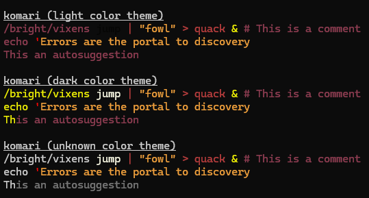
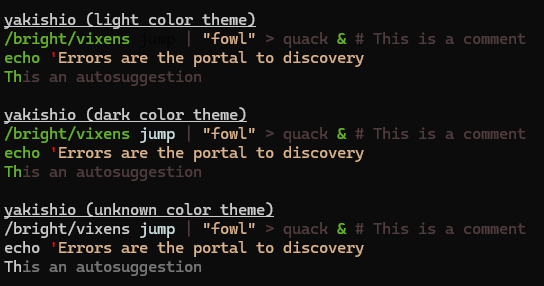
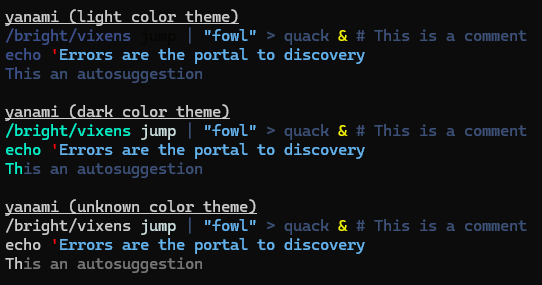

# Makeine theme
Makeine themes for [fish shell](https://fishshell.com/)

# Themes
## [Komari](./themes/Komari.theme)


## [Yakishio](./themes/Yakishio.theme)


## [Yanami](./themes/Yanami.theme)


# Install & Use
1. See and download themes inside [themes folder](./themes/)
2. Move the themes to /.config/fish/themes/
3. Check if fish recognize the themes, you should see the themes in the list
```bash
fish_config theme show
```
4. Chose and use the themes
```bash
fish_config theme choose [theme] # in current session only
fish_config theme save [theme] # global
```